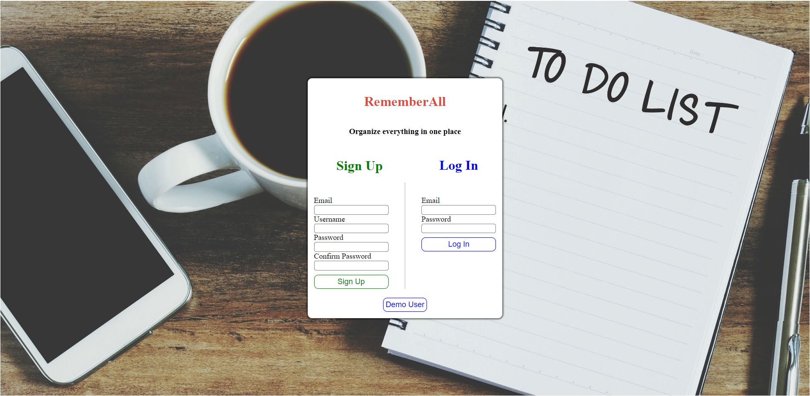
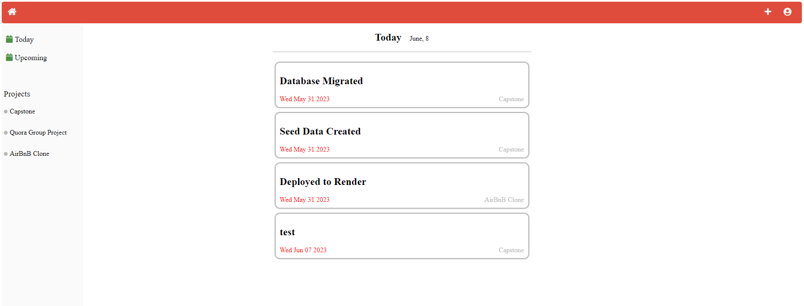
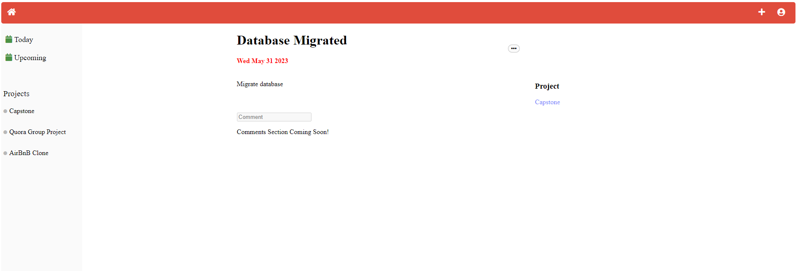
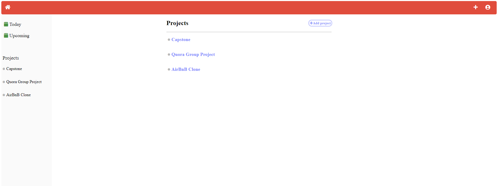
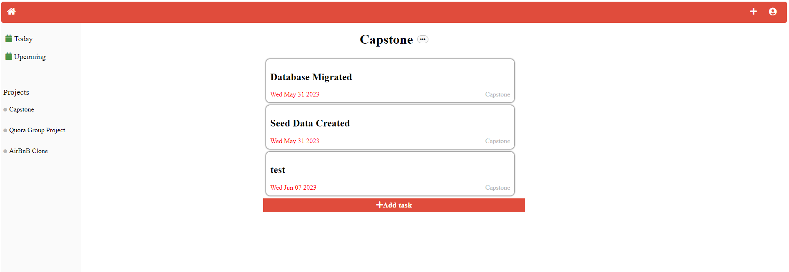

# RememberAll

RememberAll is a Flask/SQLAlchemy back end and React/Redux front end web application. It is to help users create, manage, and organize tasks in order to maximize their efficiency.


Check out [RememberAll](https://rememberall-00r2.onrender.com/)

## Index

[MVP Feature List](https://github.com/cstever0/RememberAll/wiki/Feature-List) |
[Database Scheme](https://github.com/cstever0/RememberAll/wiki/Database-Schema) |
[User Stories](https://github.com/cstever0/RememberAll/wiki/User-Stories) |
[Wire Frames](https://github.com/cstever0/RememberAll/wiki/Wireframes) |

## Technologies Used


## Login/SignUp Page


## Today Tasks



## Single Task Page with Comments


## All Projects Page


## Single Project with Tasks Page



## Getting started
1. Clone this repository (only this branch)

2. Install dependencies

      ```bash
      pipenv install -r requirements.txt
      ```

3. Create a **.env** file based on the example with proper settings for your
   development environment

4. Make sure the SQLite3 database connection URL is in the **.env** file

5. This starter organizes all tables inside the `flask_schema` schema, defined
   by the `SCHEMA` environment variable.  Replace the value for
   `SCHEMA` with a unique name, **making sure you use the snake_case
   convention**.

6. Get into your pipenv, migrate your database, seed your database, and run your Flask app

   ```bash
   pipenv shell
   ```

   ```bash
   flask db upgrade
   ```

   ```bash
   flask seed all
   ```

   ```bash
   flask run
   ```

7. To run the React App in development, checkout the [README](./react-app/README.md) inside the `react-app` directory.

# Features

## Tasks
* Users can create a Task
* Users can update their Task
* Users can delete their Task

## Projects
* Users can create a Project
* Users can delete their edit/delete their Projects


## Future Features

## Comments
* Users can create Comments on any of their Tasks
* Users can edit/delete their Comments

## Labels
* Users can create Labels
* Users can edit/delete their Labels
* Users can assign any label to any Task

## Search
* Users can search for any Task or Project
